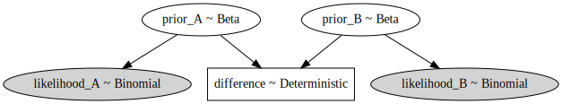
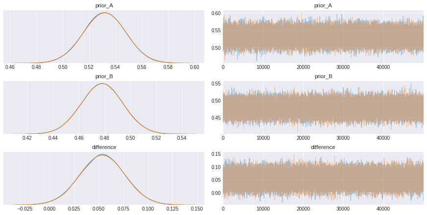
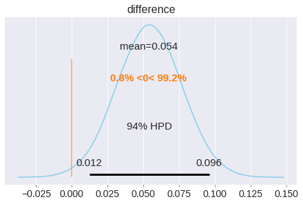

---

title:  "bayesian A/B test" 

date: 2020-05-28 
use_math: true
categories: ['ab_test'] 
permalink: /categories/abtest01
layout : category
tags: ['bayesian', 'e-commerce', 'pymc3'] 

---
<br><br>


새로운 디자인/상품/등 을 두가지 형태인 A/B 안으로 나누어 어느 것이 더 효과적인지 확인하려고 할때 사용되는 test의 한 방법이다. 일반적으로는 마케팅 영역에서 널리 사용되는데, 사용자들에게 무작위로 A안 또는 B안을 보여준 후 이에 반응하는 사용자들의 *전환율* 차이를 통해 더 나은 '안' 을 선택하는 방법이다.
  
<br>

전환율이란 주어진 '선택안'에서 유저가 반응하는 정도를 의미하는데, 이를테면 인터넷쇼핑몰의 홈페이지 구조가 서로다른 A/B안에서 A안을 보여주었을 유저들의 구매율이 높았다면 전활율은 '특정 '안'을 보여주었을 때 구매 하는 비율' 이 될것이다.  
 <br>

 실제 사례로 오바마 대통령의 선거운동 당시 기부금을 모금하는 홈페이지를 A / B안으로 나누어 전환율을 확인해 본 결과 한 화면에 모든 정보를 입력하여 기부를 하는 디자인보다 순차적으로 정보를 입력하여 모금하는 방법의 전환율이 5% 높게 나왔다. 
 <br>

|  |
|:--:|
| *모금운동 당시 테스트로 사용했던 디잔인 A / B안* |


<br><br>

## How it works
<br>

우선 디자인 후보군을 A / B안을 선정해야 하는데 A,B 디자인의 차이는 버튼의 색을 바꾼다던지, 헤드라인 글자의 크기를 조금 크게 한다던지와 같은 간단한 변화일수도 있고, 완전히 다른 홈페이지 디자인처럼 큰 변화일수도 있다. 기존의 디자인(A)와 새로운 디자인(B)를 방문하는 유저들에게 무작위로 보여주고 변화에 따른 전환율의 차이를 분석한다.


<br>  

분석의 결과, 디자인의 변화에 대해서 유저들의 전환율이 긍정적인지 부정적인지를 확인하여 더 나은 디자인을 고르게 된다.
<br>  


<br><br>

## why A/B test
<br>

  A/B 테스트는 결과 데이터를 수집하여 조금씩 조금씩 변화를 만들어 나간다. 가설을 세우고 이를 검증해 나가며 어떤 요인이 변화를 가져다 주는지에 대해 배울수있다. 또한 우리가 최선이라고 생각했던 가설이 A/B 테스트를 통해 잘못된 것이라는 걸 사전에 발견할 수 있고 이는 잘못된 의사선택으로 인한 비용을 사전에 줄일 수 있는 효과적인 방법인것이다.  
<br>  

여러 복잡한 요인들 대신에 일관적은 척도인 **전환율**을 이용하여 목적을 달성할 수 있다. 또한 한번에 하나씩의 변화는 방문자의 전환율에 변화를 미치는 특정 요인을 비교적 정확하게 짚어낼수 있다. 비용이 적게들고 빈번하고 빠르게 수행가능한 장점인 것이다.
<br>  

**단점** 이라고 한다면 혁신의 폭이 좁다는 점이다. 전환율에 미치는 요인들을 알아내기 위해서는 사소한 변화를 통해서 정확히 알아낼수 있는데 드라마틱한 변화를 통해서는 변화의 인자를 알아내기가 어려울 수 있다.
<br><br>

## process
<br>

* **데이터 수집**: 수집 단계에서는 testing이 필요한 부분을 찾아야 한다. 일반적으로는 데이터 수집이 용이하기에 트래픽이 많은 지점부터 살펴본다. 전환율이 낮거나 이탈률이 높은 지점은 향상의 가능성이 있는 부분이기에 적절한 선택이 될 수 있다.

* **목표 구체화**: 전환율의 척도를 무엇으로 삼을지 정해야 한다. 위의 예시처럼 기부금액의 변화를 척도로 사용한다면 이전 버젼과 새로운 버젼간의 기부금액의 차이를 통해 의사결정을 내려야할 것이다.

* **가설선택**: 목표가 정해지면 testing을 위해 가설을 세워야 한다. 왜 그러한 가설을 세웠는지, 시도하려는 변화들이 어떤점에서 기존의 버젼보다 나은것인지, 기대되는 효과는 어떨것인지 등에 대해서 정리해야한다

* **변화선택**: 가설에 근거하여 실제 변화를 줄 부분을 정하는 단계이다. 버튼의 색깔을 조금 바꾼다던지, 광고창을 조금 줄인다던지, 글자체를 바꾸는 것 등 이다.

* **실험**: 이제는 유저들의 반응을 확인하는 단계이다. 랜덤하게 유저들에게 두가지 안 중 하나를 보여주고 이에 대한 전환율에 대한 정보를 얻는다

* **결과분석**: 실험이 끝나면 수집한 유저들의 데이터를 통해서 어떤 '안'이 긍정적인 전환율을 가져다 주었는지 통계적인 분석을 통해 알아낸다.


<br><br>
## bayesian A/B test
<br>

베이지안 A/B 테스트는 베이지안의 특징인 사전정보를 이용하여 전환율을을 점추정 하는것이 아니라 분포의 형태로 나타내어 불확실함에 대한 정보를 제공해준다.
<br>

기존의 경험에 근거하면 전환율에 대해서 정확한 수치는 아니더라도 어느 범위에 위치해 있을것이라는 생각은 가지고 있을 것이다. **전환율**의 경우 비율이기 때문에 그 범위가 [0,1]로 자연스럽게 정해진다. **베타 분포**는 값의 범위가 마찬가지로 [0,1] 이기 때문에 이와가튼 확률을 다루는 문제에 적합하다. 베타분포를 사전분포로 사용할 수 있다.
<br>  

|  |
|:--:|
| *사전확률분포* |

<br>

사전확률분포를 정하고 난후 데이터 수집을 통해 사후 확률을 구한다. 각각의 대안 A/B에 대해서 사후 확률을 구함으로써 우리가 내리는 결론이 얼마나 불확실한지에 대한 정보를 알 수 있다. 이러한 정보는 의사결정시에 중요한 정보로 활용될 수 있다.
<br>

|  |
|:--:|
| *사후확률분포* |

<br>

## bayesian A/B test using PYMC3
잘 알려진 베이지안 추론 라이브러리인 pymc를 통해서 한번 예제를 살펴보자.


```python
import pymc3 as pm
import theano
import numpy as np
import seaborn as sns
import warnings
import matplotlib.pyplot as plt


plt.style.use('seaborn-darkgrid')
warnings.filterwarnings('ignore')
```


```python
# plotting을 도와주는 arviz.
!pip install arviz
import arviz as az
```

우리는 두가지의 광고 안에 대해서 결정을 내리려고 한다. A/B 테스트를 이용하여 전환율을 확인해보자.
* **n** = A, B안을 보여준 유저수
* **obs_A** : A안을 보여준 유저들중 구매로 이어진 횟수
* **obs_B** : B안을 보여준 유저들중 구매로 이어진 횟수


```python
n = 1000
obs_A = 532
obs_B = 478
```

사전 확률로는 베타 분포를 선택한다. 범위가 0과 1사이 이기때문에 전환율을 다루는 문제에서는 좋은 출발이 될 수 있다.


```python
with pm.Model() as ad_model:
  prior_A = pm.Beta('prior_A', alpha=2, beta=2)
  prior_B = pm.Beta('prior_B', alpha=2, beta=2)

  likelihood_A = pm.Binomial('likelihood_A', n=n, p=prior_A, observed=obs_A)
  likelihood_B = pm.Binomial('likelihood_B', n=n, p=prior_B, observed=obs_B)
```

추가로, 두 안 의 값 차이를 


```python
with ad_model:
  pm.Deterministic('difference', prior_A - prior_B) # 두 '안'의 차이.
```

모델을 그래프로 시각화 시키면 다음과 같다


```python
pm.model_to_graphviz(ad_model)
```





```python
with ad_model:
  trace = pm.sample(draws=50000, tune=5000) # 나은 근사를 위해서는 draws의 횟수가 클수록 좋다
```

    Auto-assigning NUTS sampler...
    Initializing NUTS using jitter+adapt_diag...
    Sequential sampling (2 chains in 1 job)
    NUTS: [prior_B, prior_A]
    100%|██████████| 55000/55000 [00:35<00:00, 1567.07it/s]
    100%|██████████| 55000/55000 [00:35<00:00, 1559.13it/s]


```python
_ = az.plot_trace(trace)
```





```python
_ = az.plot_posterior(trace, var_names=['difference'], 
                      ref_val=0, color='#87ceeb')
```





결과, **A광고의 전환율이 B 광고의 전환율 보다 클 확율이 99.2%이다. 반대로 B 광고가 A광고보다 전환율이 높을 가능성은 고작 0.8%라고 할 수 있다.** 광고 A의 전환율이 높음을 알 수 있다.

## Reference
https://www.optimizely.com/optimization-glossary/ab-testing/

